# Build Movie Recommendation Engine with Amazon Personalize

## Overview

<div>
<p align="center">
    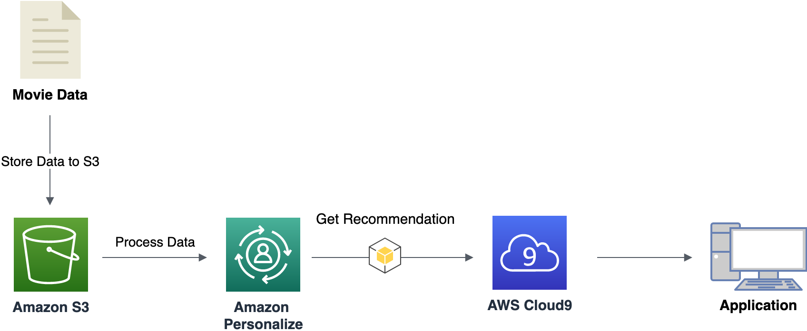
</p>
</div>

[Amazon Personalize](https://aws.amazon.com/personalize/?nc1=h_ls) is a machine learning service that makes it easy for developers to create individualized recommendations for customers using their applications.

With **Amazon Personalize**, you provide an activity stream from your application – **page views, signups, purchases**, and so forth – as well as an inventory of the items you want to recommend, such as **articles, products, videos, or music**. You can also choose to provide **Amazon Personalize** with additional demographic information from your users such as **age, or geographic location**. **Amazon Personalize** will process and examine the data, identify what is meaningful, select the right algorithms, and train and optimize a personalization model that is customized for your data.

In this lab, we are going to import an **user-item interaction** dataset from S3 bucket, if you don't have an user-item interaction data you can install the **SDK** provided by Amazon. On the next step, we use the data to **create a solution**, after creating the solution we **create a campaign**. These steps you can also called it train data. At the last part, we can finally **generate a recommendation system**.

## Prerequisites

* Download [ratings.csv](./masterials/ratings.csv) to local, this dataset is a list of movie ratings rate by over 1,000 people, the columns includes `USER_ID,RATING`, `TIMESTAMP`, `ITEM_ID`, and `RATING`.

## Create S3 bucket

- On the Service menu, select [S3](https://s3.console.aws.amazon.com/s3/home?region=us-east-1).

- Select **Create bucket**.
<center>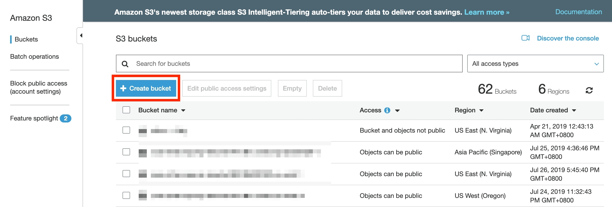</center>

- Type an ***unique name*** for your **S3 bucket**.(e.g., movie-dataset-yourname)

- Select **Create** on the down-left of the create console.
<center>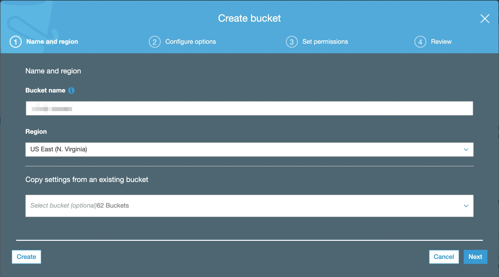</center>

- Search for your bucket name and click it on the name to enter the bucket.

- Select **Permissions** tab, select **Block public access**, click **Edit**. 
> We will modify the public access settings to make your objects **Public** which can be used to import dataset to the **Amazon Personalize**.

- Uncheck all the ☑, select **Save**.

<center>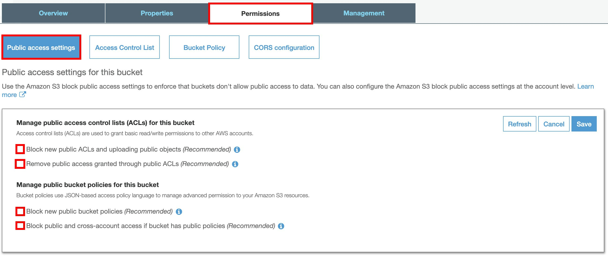</center>

- Select **Bucket policy**, copy and paste the json code below, remember to change **<your-bucket-name\>** to your own bucket name, and select **Save**. 

<center>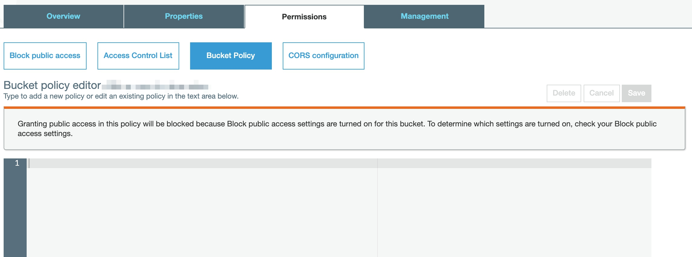</center>

- This **Bucket policy** is for **Amazon Personalize** to get data and list data in **S3 bucket**.
```json
{
    "Version": "2012-10-17",
    "Id": "PersonalizeS3Bucket AccessPolicy",
    "Statement": [
        {
            "Sid": "PersonalizeS3BucketAccessPolicy",
            "Effect": "Allow",
            "Principal": {
                "Service": "personalize.amazonaws.com"
            },
            "Action": [
                "s3:GetObject",
                "s3:ListBucket"
            ],
            "Resource": [
                "arn:aws:s3:::<your-bucket-name>",
                "arn:aws:s3:::<your-bucket-name>/*"
            ]
        }
    ]
}
```

- Select **Create folder**, type **movie rating** for the folder name.
<center>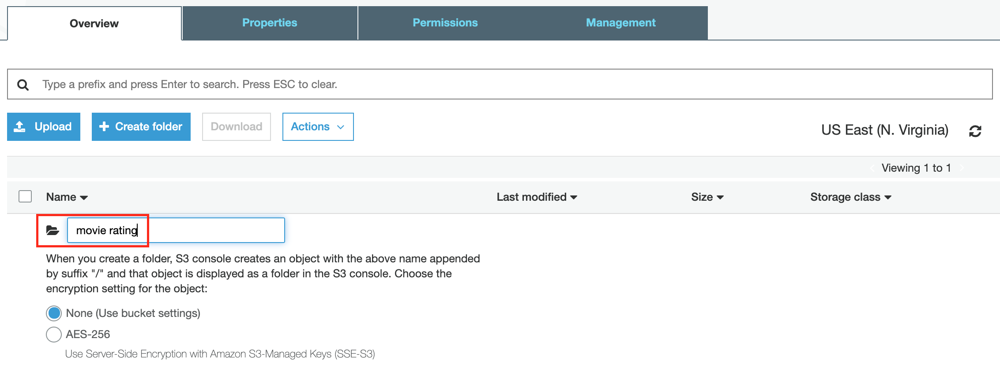</center>

- Click on the folder name to enter the folder.

- Select **Upload**, select **Add files**, choose the [ratings.csv](./masterials/ratings.csv) we downloaded in the **Prerequisites**, select **Upload** on the down-left of the upload console.
<center>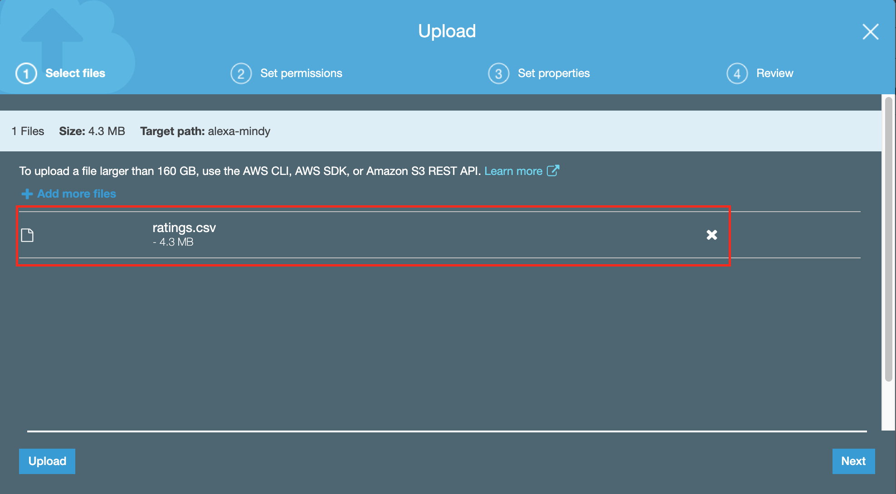</center>

- Select the file to enter.

- Click **Make Public** to make the file accessilbe.

<div>
<p align="center">
    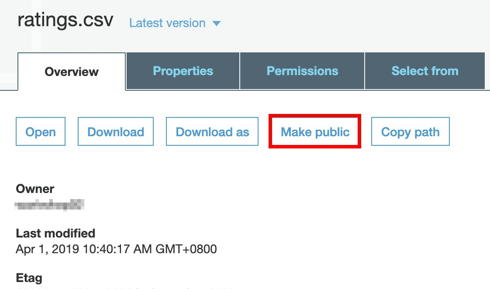
</p>
</div>

## Create IAM Role
In this section, we create an **IAM Role** for **Amazon Personalize** to read data from **S3 bucket**, and also push logs to **CloudWatch** which enables users to easily debug.

- On the **Service** menu, select [IAM](https://console.aws.amazon.com/iam/home?region=us-east-1#/home).

- Select **Roles** on the left navigation pane, select **Create role**.
<center>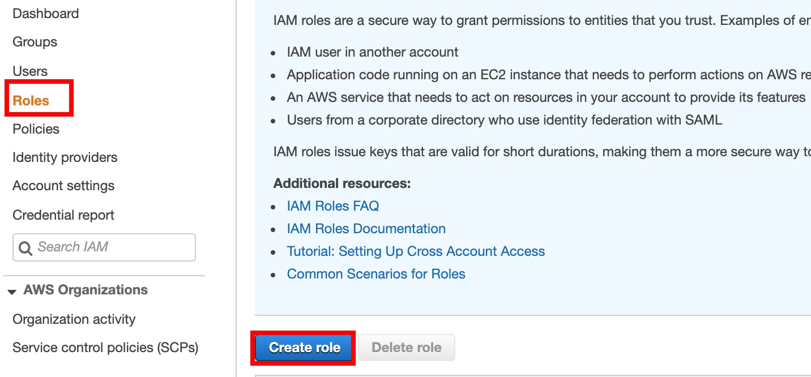</center>

- Select **AWS service** under **Select type of trusted entity**, as for **Choose the service that will use this role** select **Personalize**, if you can't find it just select **EC2**, select **Next:Permissions**.

- Search and ☑:
    * **AmazonS3ReadOnlyAccess**
    * **CloudWatchFullAccess**

- Select **Next:Tags** add tags if you want, otherwise select **Next:Review**.

- Type ```PersonalizeRole``` for **Role name**, and make sure you have attach the two policies, select **Create role**.

<div>
<p align="center">
    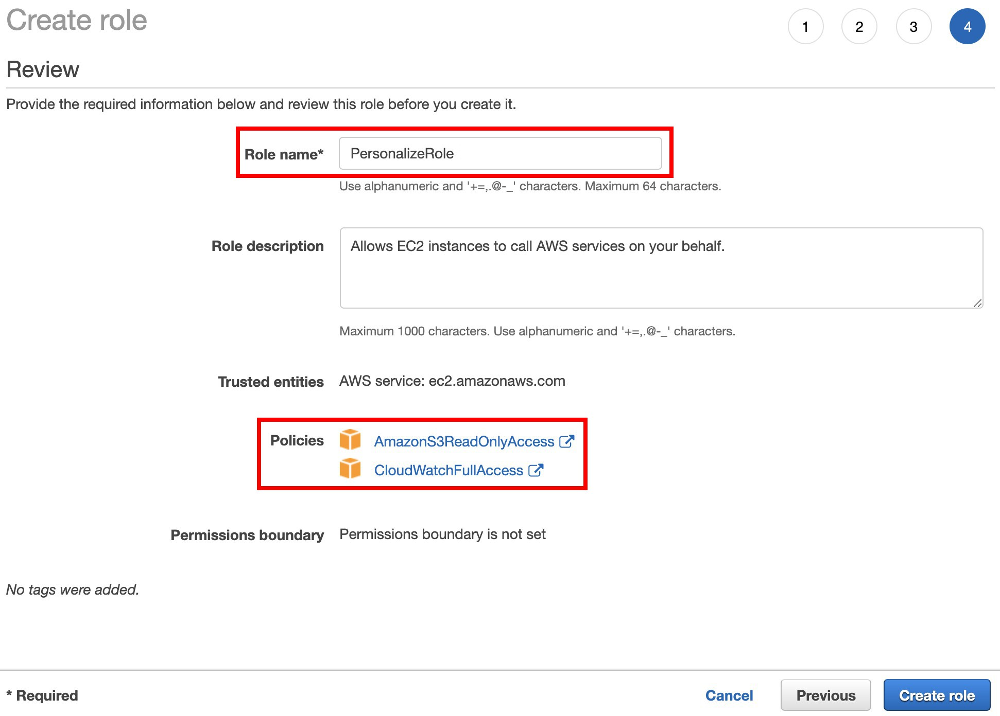
</p>
</div>

- Search for the **Role name**: ```PersonalizeRole``` you just created.

- Copy the **Role ARN** into your notepad, we will use it later.

- Select **Trust relationships**, select **Edit trust relationship**.

- Copy and paste the json code below to change the **Policy Document**:

* Because we couldn't find **Amazon Personalize** at the **Select type of trusted entity** section, so we modify the **Trust relationships** service to `personalize.amazonaws.com`.

```json
{
  "Version": "2012-10-17",
  "Statement": [
    {
      "Effect": "Allow",
      "Principal": {
        "Service": "personalize.amazonaws.com"
      },
      "Action": "sts:AssumeRole"
    }
  ]
}
```

- Select **Update trust policy**.

## Create dataset group
In this part, we create a dataset group with the data we uploaded to **S3 bucket**, we have to give **Amazon Personalize** a static format as a **json format** to let it recognize the dataset.

- On the Service menu, select [Amazon Personalize](https://console.aws.amazon.com/personalize/home?region=us-east-1#start).

- If you are using **Personalize** for the first time, select **Get Started**, otherwise select **Create dataset group**, select **Next**.

- In **Dataset group name** type ```my-personalize-dataset-group```.

<div>
<p align="center">
    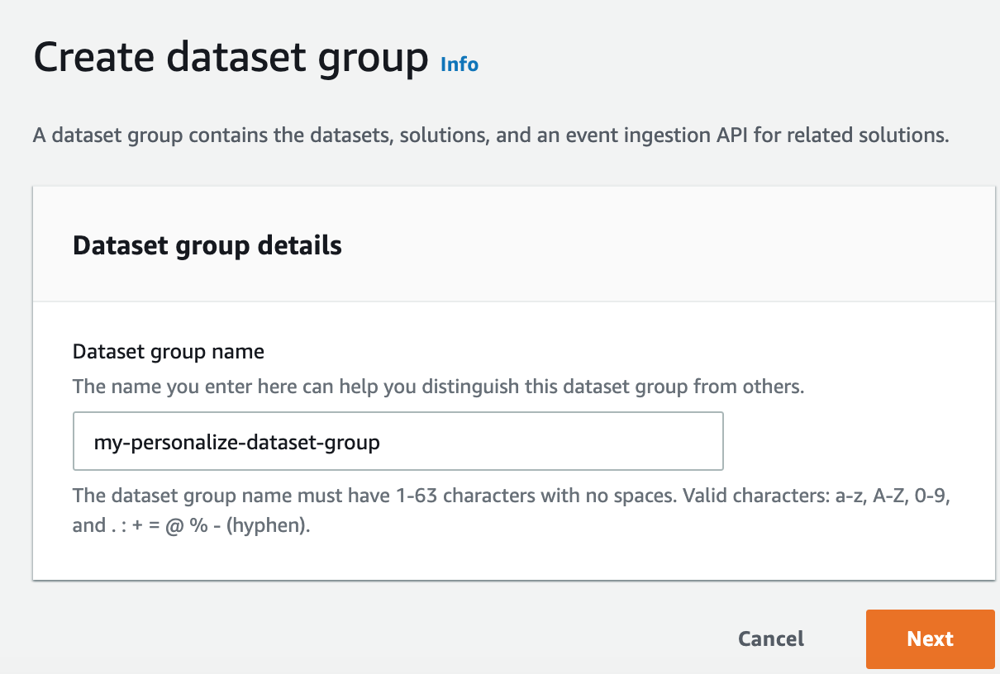
</p>
</div>

- Select **Next**.

- In **Dataset name** type ```my-dataset```.

- In **Schema selection** choose **Create new schema**, and type ```my-schema``` for **New schema name**, copy and paste the json code below into the **Schema definition** section.
> **User-item interaction data** json format **must** have these three **fields**:
>    * USER_ID
>    * ITEM_ID
>    * TIMESTAMP

> You can add other fields after having these three fields.

```json
{
	"type": "record",
	"name": "Interactions",
	"namespace": "com.amazonaws.personalize.schema",
	"fields": [
		{
			"name": "USER_ID",
			"type": "string"
		},
		{
			"name": "ITEM_ID",
			"type": "string"
		},
		{
			"name": "RATING",
			"type": "string"
		},
		{
			"name": "TIMESTAMP",
			"type": "long"
		}
	],
	"version": "1.0"
}
```

- Select **Next**.

- Type ```my-dataset-import``` for **Dataset import job name** and paste your **Role ARN** into **Custom IAM role ARN**, type your S3 path for [ratings.csv](./masterials/ratings.csv) as ```s3://<your-bucket-name>/movie rating/ratings.csv```.

<div>
<p align="center">
    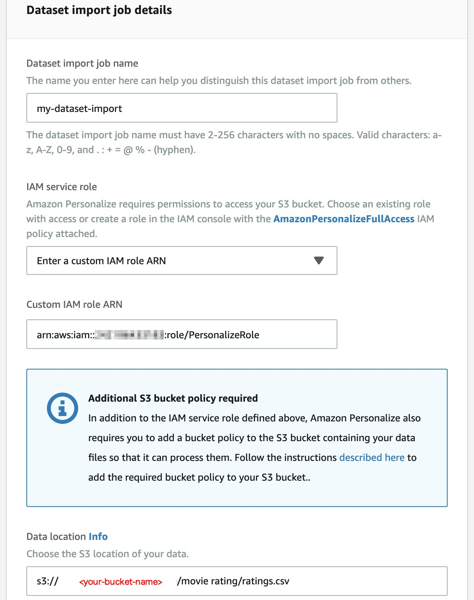
</p>
</div>

- Select **Finish**.

- Wait for the **User-item interaction data** create, it will become **Active** after created, this might take 5-10 minutes.

## Create solutions
In this part, we are going to create a solution, the advantage of using **Amazon Personalize** is that you don't have to have machine learning experience to train a solution, so in this part we will choose a **Automatic ML** recipe provided by Amazon.

- Select **Start** at the **Create solutions** pane.

<div>
<p align="center">
    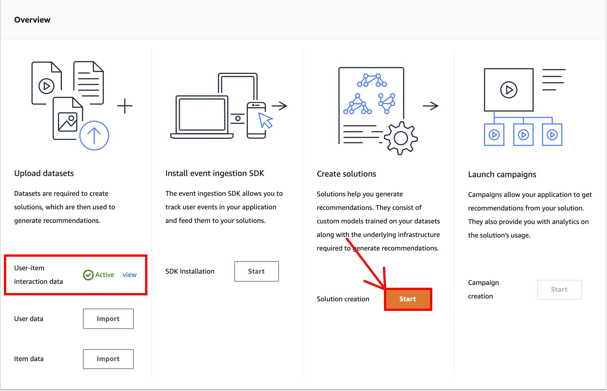
</p>
</div>

- In **Solution name** type ```my-solution```, and 
☑ **Automatic (AutoML)**

<div>
<p align="center">
    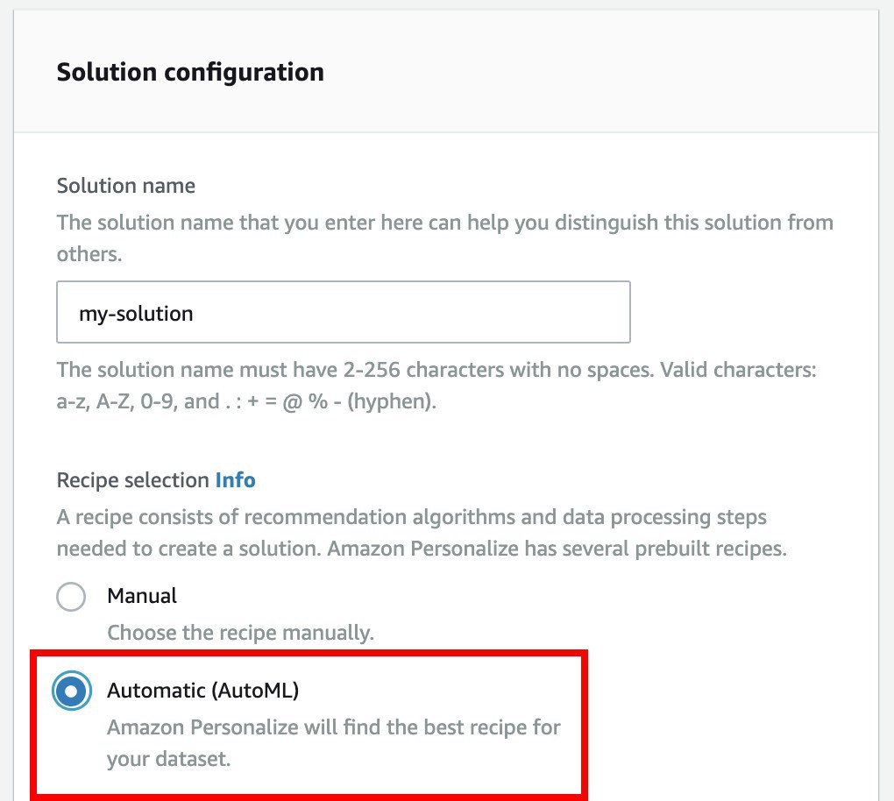
</p>
</div>
- This will default select three machine learning recipe, the three methods details:

- [aws-hrnn](https://docs.aws.amazon.com/personalize/latest/dg/native-recipe-hrnn.html)
    - The recommended timing is that user behavior changes over time (progressive intent issues).
- [aws-hrnn-metadata](https://docs.aws.amazon.com/personalize/latest/dg/native-recipe-hrnn-metadata.html)
    - Similar to the HRNN recipe, with additional features derived from contextual, user, and item metadata.

<div>
<p align="center">
    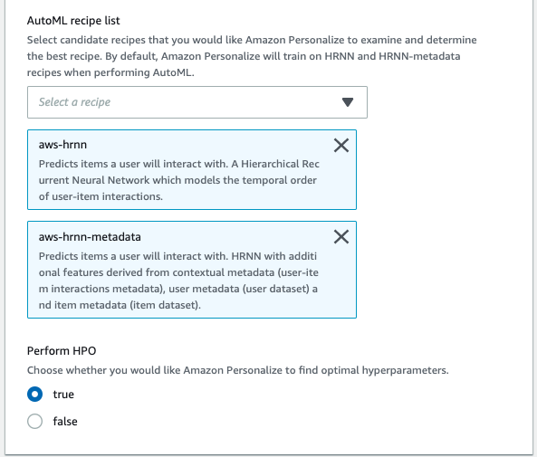
</p>
</div>


- Select **Next** check the details of this solution if there is no problem, select **Finish**.

- Wait for the **Solution versions** at least one is Active, this might take 30-40 minutes.
<div>
<p align="center">
    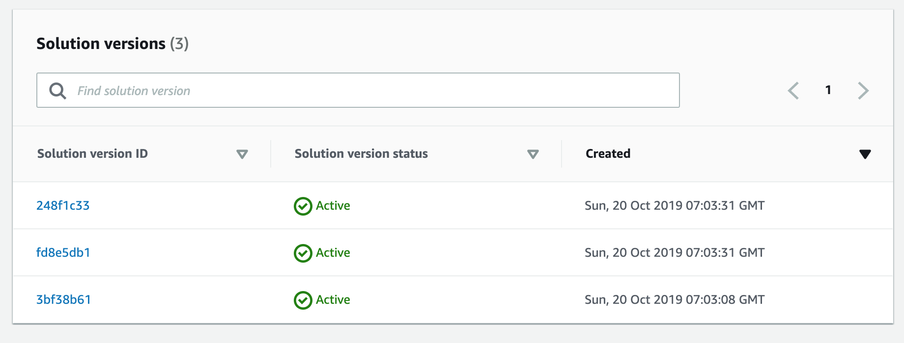
</p>
</div>


## Create Campaign
In this part, we are going to the last part of **Amazon Personalize**, generating the recommend page with the solution created at last part.

- Select **Create new campaign** at the **Launch campaigns** pane.

<div>
<p align="center">
    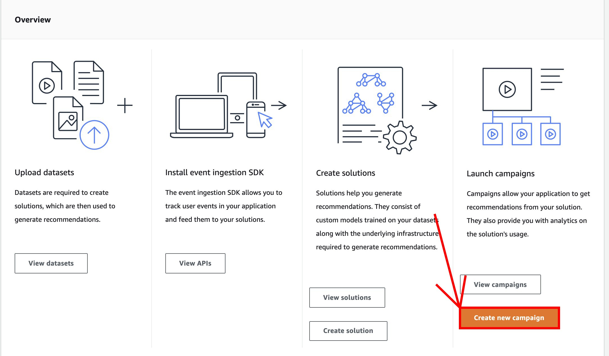
</p>
</div>

- Type ```my-campaign``` for **Campaign name**, select **my-solution** for **Solution**, and leave the **Minimum provisioned transactions per second** as default.

<div>
<p align="center">
    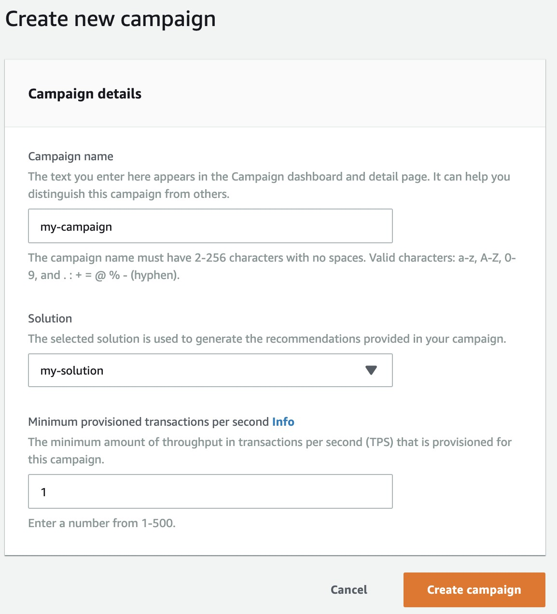
</p>
</div>

- Wait for the **Campaign** to create, this might take 10-20 minutes.

- After creation, you will see this dashboard, you can input a **USER_ID** you like, and click **Get recommendations**, for example: ```200```, and below will output the recommend movie's names.

<div>
<p align="center">
    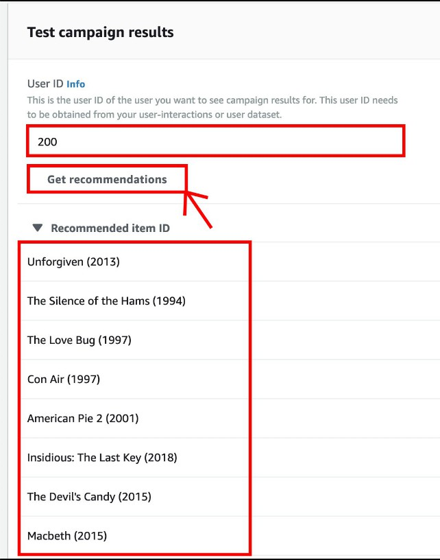
</p>
</div>

- Please copy **Campaign ARN** in the Campaign inference.
<div>
<p align="center">
    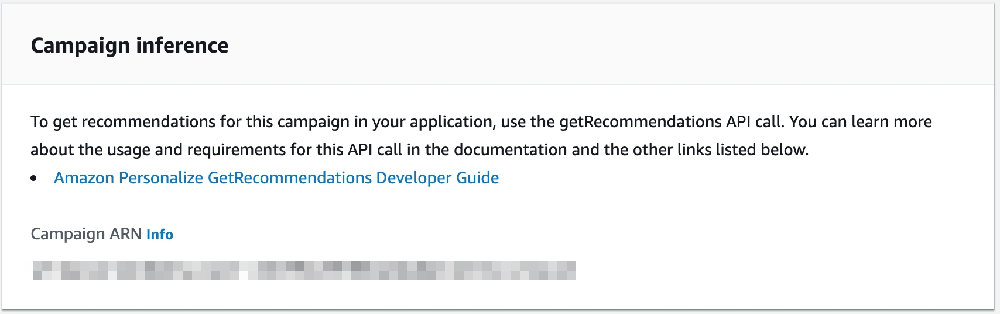
</p>
</div>

## 
- For use the OMDB API to get more movie information. We need to apply the API key for use API.

- Click the [link](http://www.omdbapi.com/apikey.aspx) to generate API Key.

- Choose __FREE! (1,000 daily limit)__ plan to use api key.

- Enter your Email, First Name, Last Name and the reason for Use, and then click submit.
<p align="center">
    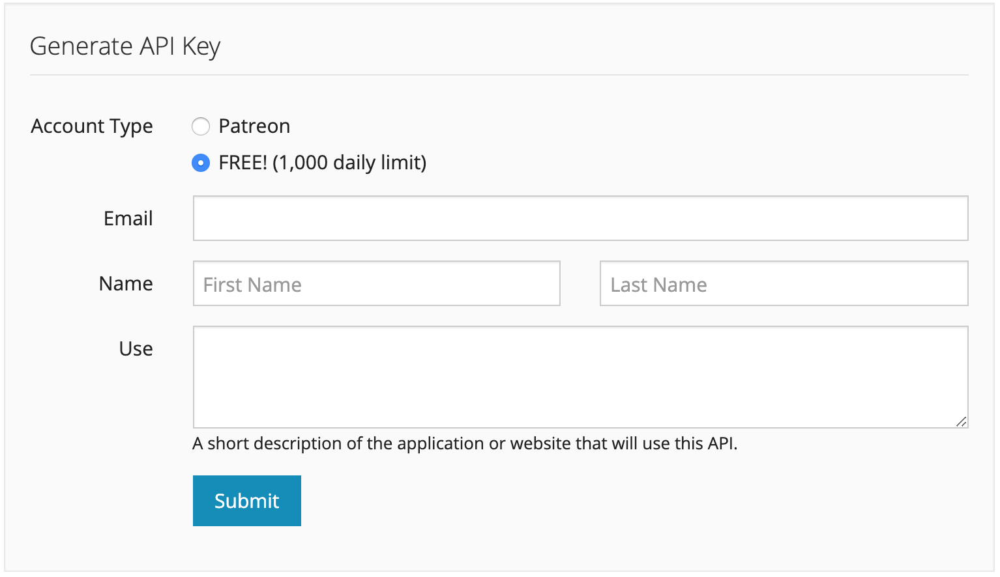
</p>

- Check the mail box, and you need to click the link to activate you api key.
<p align="center">
    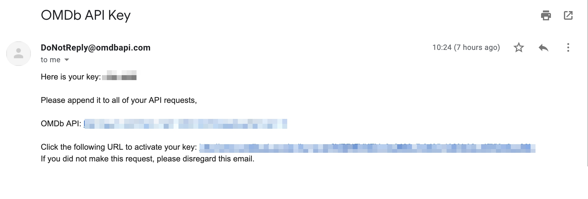
</p>

- When you activate the api key, please note the OMDb API in the mail and we will use it latter.

## Integerate to your Application

- On the Service menu, select [AWS Cloud9](https://console.aws.amazon.com/cloud9/home?region=us-east-1#start).

- Click **Create environment**.

- Enter the name of your environment in **Name** (e.g., **Personalize-Prediction**),click **Next step**.

- Select **Create a new instance for environment (EC2)** and **t2.micro (1 GiB RAM + 1 vCPU)** for Environment type and Instance type, click **Next step**.

- Click **Create environment**
You will need to wait Cloud9 for setup environment in a few minutes <br>

- Paste command at below terminal.
```
git clone xxx
```
- Install latest boto3 to Cloud9 environment.
```
sudo python -m pip install boto3
```
- Install requests for call OMDB API and get response.
```
sudo python -m pip install requests
```
- Install Flask build the application.
```
sudo python -m pip install Flask
```
- Open the **./masterials/flask-app/personalize.py** and paste the __Campaign Arn__ in line 17.

- Paste your api key url in line 20.

- Open the **./masterials/flask-app/app.py**,click **Run** on the toolbar and click **Preview Running Application** in **Preview**.
<p align="center">
    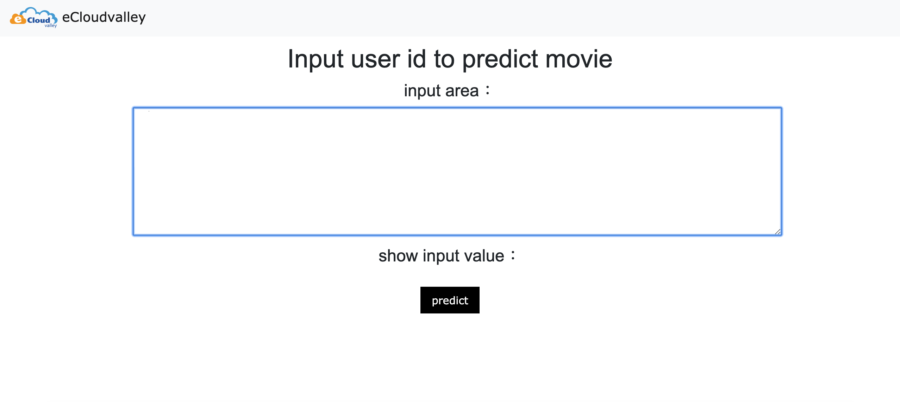
</p>

- Enter the user id and click predict.
<p align="center">
    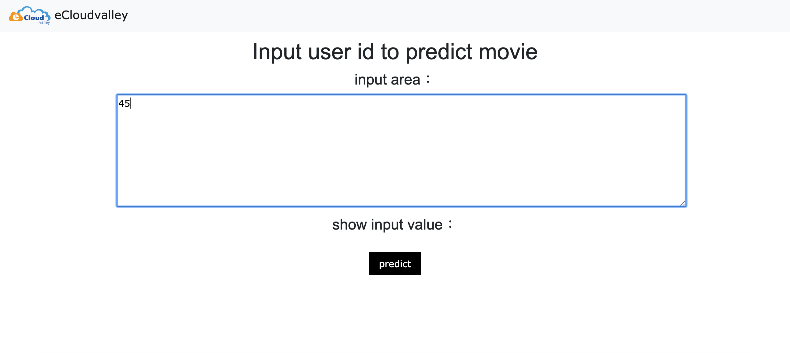
</p>

- You will see the result like below.
<p align="center">
    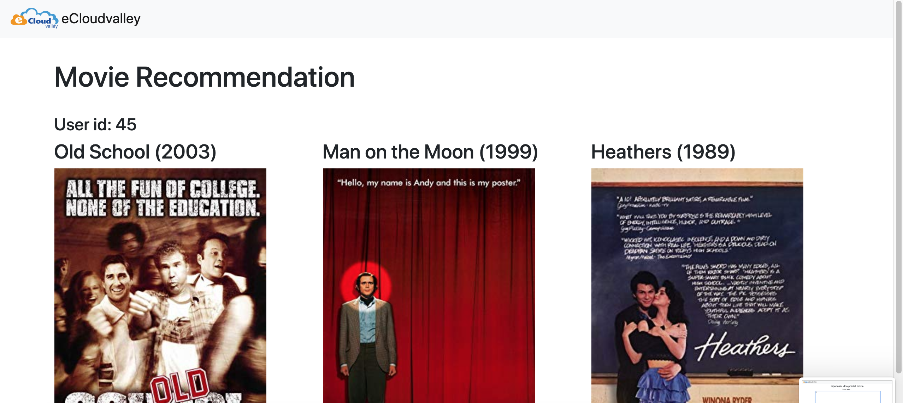
</p>

## Conclusion
Congratulations! You have learned how to **upload a dataset group** which contains user and item interactions the most important part is that there must be over 1,000 set of data so that the recommendation system will be more acurate. Learn how to use a machine learning service without any machine learning experience by the method provided by **Amazon Personalize**. At last, **generate a personalize recommendation system by using Amazon Personalize**. 